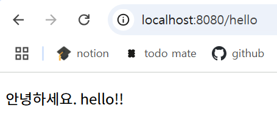
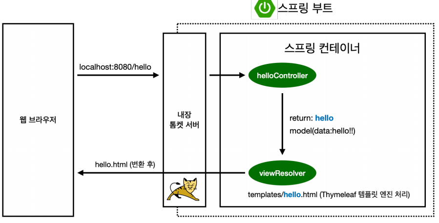

# 프로젝트 환경설정
> 본 게시물은 김영한님의 "스프링 입문 - 코드로 배우는 스프링 부트, 웹 MVC, DB 접근 기술" 강의를 듣고 정리한 내용입니다.  
게시물에 포함된 코드와 이미지 등의 모든 저작권은 인프런과 김영한 강사님께 있습니다.   
> 출처 : [Inflern_김영한] [스프링 입문 - 코드로 배우는 스프링 부트, 웹 MVC, DB 접근 기술](https://www.inflearn.com/course/%EC%8A%A4%ED%94%84%EB%A7%81-%EC%9E%85%EB%AC%B8-%EC%8A%A4%ED%94%84%EB%A7%81%EB%B6%80%ED%8A%B8/dashboard)

**Object**
1. [프로젝트 생성](#프로젝트-생성)
2. [라이브러리 살펴보기](#라이브러리-살펴보기)
3. [View 환경설정](#view-환경설정)
4. [빌드하고 실행하기](#빌드하고-실행하기)

## 프로젝트 생성
스프링 부트 스타터 사이트에서 스프링 프로젝트 생성   
https://start.spring.io

- `src`
  - `main`: 실제 package와 source 파일
  - `test`: 테스트 코드와 관련된 source 파일
  - 요즘은 위와 같이 main과 test 폴더를 나누는 것이 표준화 되어있음
  - `build.gradle`: 버전 설정 및 라이브러리 가져오기
    - `repositories`: 라이브러리 다운 경로
    - `dependencies`: 템플릿 엔진

## 라이브러리 살펴보기
- gradle, maven 같은 build tool은 의존 관계를 다 관리해줌
  - 의존 관계가 있는 라이브러리를 함께 다운로드 함

- `spring-boot-starter-web`
  - `spring-boot-starter-tomcat`
    - 웹 서버 (임베디드 내장)
  - `spring-webmvc`
- `spring-boot-starter-thymeleaf`
  - 타임리프 템플릿 엔진(View)
- `spring-boot-starter`
  - autoconfigure, dependencies, logging, core ...
  - `logging`
    - 현업에서는 System.out.println() 대신 log를 사용해 출력해야 함
    - log로 남겨야 심각한 에러만 따로 모으거나 log 파일을 관리할 수 있음
    - slf4j, logback -> 요즘은 logback 많이 씀
- `spring-boot-starter-test`
  - 대부분 **junit** 사용 (테스트 프레임워크)
  - `mockito`
  - `assertj`
    - 테스트 코드를 좀 더 편리하게 작성하도록 도와줌
  - `spring-test`
    - spring과 통합하여 테스트 도와줌

## View 환경설정
### Welcome Page 만들기
도메인만 누르고 들어왔을 때 첫 화면

`resources/static/index.html`에 생성하면 됨 -> 정적 페이지
```html
<!DOCTYPE HTML>
<html>
<head>
  <title>Hello</title>
  <meta http-equiv="Content-Type" content="text/html; charset=UTF-8" />
</head>
<body>
Hello
<a href="/hello">hello</a></body>
</html>
```


https://spring.io 에서 검색 기능 적극 활용하기

### thymeleaf 템플릿 엔진
- thymeleaf 공식 사이트: https://www.thymeleaf.org/
- 스프링 공식 튜토리얼: https://spring.io/guides/gs/serving-web-content/

`controller`: 웹 애플리케이션에서 첫 번째 진입점

```java
@Controller
public class HelloController {
  @GetMapping("hello")
  public String hello(Model model) {
    model.addAttribute("data", "hello!!");
    return "hello";
  }
}
```

`resources/templates/hello.html`에 생성
```html
<!DOCTYPE HTML>
<html xmlns:th="http://www.thymeleaf.org">
<head>
  <title>Hello</title>
  <meta http-equiv="Content-Type" content="text/html; charset=UTF-8" />
</head>
<body>
<p th:text="'안녕하세요. ' + ${data}" >안녕하세요. 손님</p>
</body>
</html>
```



### 동작 환경

- 컨트롤러에서 리턴 값으로 문자를 반환하면 `viewResolver`가 화면을 찾아서 처리
  - 스프링 부트 템플릿 엔진 기본 viewName 매핑
  - `resources/templates/`+{ViewName}+`.html`

## 빌드하고 실행하기

1. `./gradlew build` -> **나는 `./gradlew.bat`라고 해야 성공적으로 빌드 됨(왜지?)**
2. `cd build/libs`
3. `java -jar hello-spring-0.0.1-SNAPSHOT.jar`
4. 실행 확인

---
github에 디렉토리 push 할 때 바보 같은 짓을 함!   
나와 매우 똑같은 상황의 글을 봐서 해결함   
[branch가 여기서는 main이고 여기서는 master가 되...](https://velog.io/@jytrack/Git-Error-fatal-in-unpopulated-submodule-...-%ED%95%B4%EA%B2%B0%ED%95%98%EA%B8%B0)