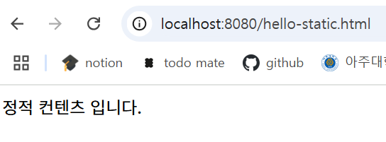
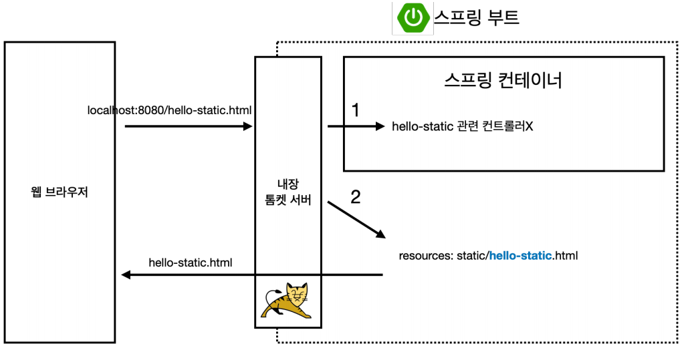
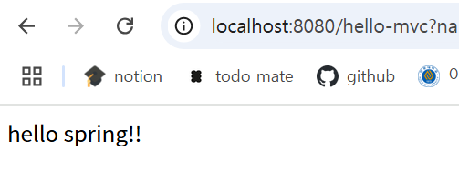
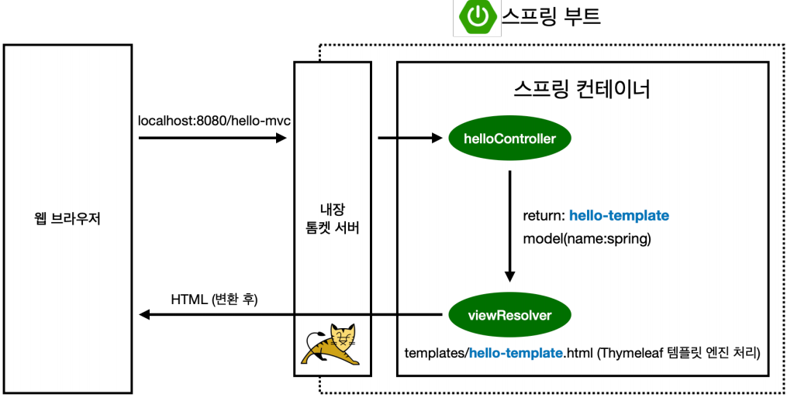

# 스프링 웹 개발 기초

**Object**
1. [정적 컨텐츠](#정적-컨텐츠)
2. [MVC와 템플릿 엔진](#mvc와-템플릿-엔진)
3. [API](#api)

## 정적 컨텐츠
파일을 그대로 웹 브라우저에 전달
- 스프링 부트는 정적 컨텐츠 기능을 자동으로 제공
`resources/static`에 생성   
```html
<!-- hello-static.html-->
<!DOCTYPE HTML>
<html>
<head>
 <title>static content</title>
 <meta http-equiv="Content-Type" content="text/html; charset=UTF-8" />
</head>
<body>
정적 컨텐츠 입니다.
</body>
</html> 
```   


**정적 컨텐츠 동작**

1. 주소를 입력하면, 내장 톰켓 서버가 요청을 받고 주소를 스프링에 넘김
2. 컨트롤러 쪽에서 hello-static이 있는지(맵핑) 찾음(컨트롤러가 우선순위를 가짐)
3. 없으면, resources에서 찾음
4. 있으면 반환

## MVC와 템플릿 엔진
서버에서 변형하여 전달   
`MVC`: Model, View, Controller
- view는 화면을 그리는 데 집중
- controller는 내부적인 처리에 집중 
- model은 화면에서 필요한 것들을 넘겨주는 데 집중
```java
@Controller
public class HelloController {
 @GetMapping("hello-mvc")
 public String helloMvc(@RequestParam("name") String name, Model model) {
 model.addAttribute("name", name);
 return "hello-template";
 }
}
```
`resources/templates/hello-template.html`에 생성
```html
<html xmlns:th="http://www.thymeleaf.org">
<body>
<p th:text="'hello ' + ${name}">hello! empty</p>
</body>
</html>
```
- `hello! empty`과 같이 내용을 넣어놓는 것은 서버 없이 html을 만들어서 볼 때 사용
- 실제 서버를 타서 템플릿 엔진으로서 동작하게 되면 `'hello ' + ${name}`과 같이 치환됨

**실행하고 `http://localhost:8080/hello-mvc` 입력하면 에러가 남!** -> `name` 값이 없기 때문
- `http://localhost:8080/hello-mvc?name=spring!!`와 같이 값을 넣어주면 실행 성공~


`ctrl + p`: 파라미터 정보 보기

**MVC 동작**

1. 웹 브라우저에서 주소를 넘기면
2. 내장 톰켓 서버가 스프링에게 넘김
3. 컨트롤러에 맵핑되어 있는 거 확인
4. 컨트롤러에서 name = spring으로 바뀌고 모델에 담김
5. `${name}`: 모델에서 값을 꺼내서 치환
6. `viewResolver`가 파일을 찾아 템플릿 엔진에게 넘김 
7. 템플릿 엔진이 렌더링 해 **변환**한 후 반환


## API
데이터 구조 포맷(ex. json)으로 클라이언트에게 데이터 전달
- 서버끼리 통신할 때 주로 사용

---
무슨 토큰 어쩌고 문제를 직면... 이 글 참고해서 해결함   
[레포지토리가 왜 없는데.](https://velog.io/@minsoo1430/Git-repository-Not-Found-%EC%97%90%EB%9F%AC-%ED%95%B4%EA%B2%B0-%EB%B0%A9%EB%B2%95)