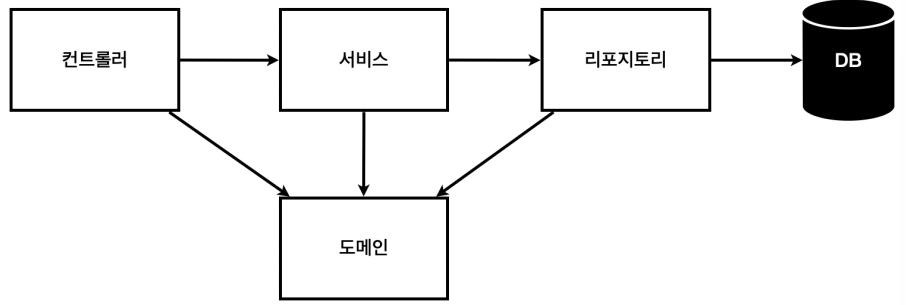
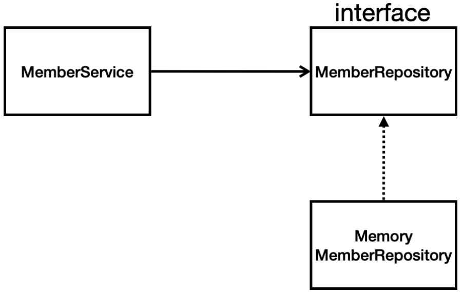

# 회원 관리 예제 - 백엔드 개발

**Object**
1. [비즈니스 요구사항 정리](#비즈니스-요구사항-정리)
2. [회원 도메인과 리포지토리 만들기](#회원-도메인과-리포지토리-만들기)
3. [회원 리포지토리 테스트 케이스 작성](#회원-리포지토리-테스트-케이스-작성)
4. [회원 서비스 개발](#회원-서비스-개발)
5. [회원 서비스 테스트](#회원-서비스-테스트)

## 비즈니스 요구사항 정리
- 데이터: 회원 ID, 이름
- 기능 : 회원 등록, 조회
- 아직 데이터 저장소가 선정되지 않음 (가상의 시나리오)

**일반적인 웹 애플리케이션 계층 구조**
   
- **컨트롤러**: 웹 MVC의 컨트롤러 역할
- **서비스**: 핵심 비즈니스 로직 구현
  - ex. 중복 가입이 안되는 등의 로직
- **리포지토리**: 데이터베이스에 접근, 도메인 객체를 DB에 저장하고 관리
- **도메인**: 비즈니스 도메인 객체
  - ex. 회원, 주문, 쿠폰 등등 주로 데이터 베이스에 저장하고 관리됨

**클래스 의존 관계**
   
- 아직 데이터 저장소가 선정되지 않아서, 우선 **인터페이스**로 구현 클래스를 변경할 수 있도록 설계
- 데이터 저장소는 RDB, NoSQL 등등 다양한 저장소를 고민 중인 상황으로 가정
- 개발을 진행하기 위해서 초기 개발 단계에서는 구현체로 가벼운 메모리 기반의 데이터 저장소 사용

## 회원 도메인과 리포지토리 만들기
**`alt + enter`**: import

**회원 객체**    
```java
// domain/Member
public class Member {

    private Long id; // 시스템이 저장하는 id
    private String name;

    public Long getId() {
        return id;
    }

    public void setId(Long id) {
        this.id = id;
    }

    public String getName() {
        return name;
    }

    public void setName(String name) {
        this.name = name;
    }
}
```

**회원 리포지토리 인터페이스**   
```java
// repository/MemberRepository
public interface MemberRepository {
    Member save(Member member); // 회원이 저장소에 저장
    Optional<Member> findById(Long id); // id 찾기
    Optional<Member> findByName(String name); // name 찾기
    List<Member> findAll(); // 지금까지 저장된 모든 회원 리스트 반환
}
```

**회원 리포지토리 메모리 구현체**
```java
// repository/memoryMemberRepository
// 동시성 문제 고려 X (실무에서는 ConcurrentHashMap, AtomicLong 사용 고려)
public class MemoryMemberRepository implements MemberRepository {

    private static Map<Long, Member> store = new HashMap<>();
    private static long sequence = 0L;

    @Override
    // store에 넣기 전에 mamber에 id 값 세팅
    public Member save(Member member) {
        member.setId(++sequence);
        store.put(member.getId(), member);
        return member;
    }

    @Override
    // store에서 꺼내기
    public Optional<Member> findById(Long id) { 
        // 결과가 없을 때을 대비해 optional로 감쌈
        return Optional.ofNullable(store.get(id)); 
    }

    @Override
    // store에서 member.getName이랑 name이 같은지 확인. 같은 경우에만 필터링(반환)
    public Optional<Member> findByName(String name) { 
        return store.values().stream()
                .filter(member -> member.getName().equals(name))
                .findAny();
    }

    @Override
    public List<Member> findAll() {
        return new ArrayList<>(store.values()); // values == member
    }
}
```

## 회원 리포지토리 테스트 케이스 작성
- 개발한 기능을 실행해서 테스트 할 때 자바의 main 메서드를 통해서 실행하거나, 웹 애플리케이션의 컨트롤러를 통해서 해당 기능을 실행함.
  - 이러한 방법은 준비하고 실행하는데 오래 걸리고, 반복 실행하기 어렵고 여러 테스트를 한 번에 실행하기 어렵다는 단점이 있음
  - 자바는 **JUnit**이라는 프레임워크로 테스트를 실행해서 이러한 문제를 해결함
  
**회원 리포지토리 메모리 구현체 테스트**   
**`shift + F6`**: 이름 한 번에 바꾸기(신기하다)   
**`ctrl + alt + v`**: 변수 추출하기(신기방기)

```java
// sre/test/java
// repository/MemoryMemberRepositoryTest
class MemoryMemberRepositoryTest {

    MemoryMemberRepository repository = new MemoryMemberRepository();

    @AfterEach // 메서드 실행이 끝날 때마다 동작
    public void afterEach() {
        repository.clearStore();
    }

    @Test
    public void save() {
        // given
        Member member = new Member();
        member.setName("spring");

        // when
        repository.save(member);

        // then
        // optional에서 값 꺼낼 때: get()
        Member result = repository.findById(member.getId()).get();
        
        // Assertions.assertEquals(member, result);
        assertThat(result).isEqualTo(member);
    }

    @Test
    public void findByName() {
        // given
        Member member1 = new Member();
        member1.setName("spring1");
        repository.save(member1);

        Member member2 = new Member();
        member2.setName("spring2");
        repository.save(member2);

        // when
        Member result = repository.findByName("spring1").get();

        // then
        assertThat(result).isEqualTo(member1);
    }

    @Test
    public void findAll() {
        // given
        Member member1 = new Member();
        member1.setName("spring1");
        repository.save(member1);

        Member member2 = new Member();
        member2.setName("spring2");
        repository.save(member2);

        // when
        List<Member> result = repository.findAll();

        // then
        assertThat(result.size()).isEqualTo(2);
    }
}
```
- 동작 순서는 보장 X
  - 모든 테스트는 순서랑 상관없이 메서드 별로 다 따로 동작하게 설계 해야 함 (의존 관계가 있으면 안됨)
  - 테스트가 하나 끝나면 데이터를 **클리어** 해줘야 함
  - **`@AfterEach`**: 한 번에 여러 테스트를 실행하면 메모리 DB에 직전 테스트의 결과가 남을 수 있음 -> 다음 테스트 실패 가능성 증가 -> `@AfterEach`를 사용하면 각 테스트가 종료될 때 마다 이 기능을 실행

## 회원 서비스 개발
**`ctrl + shift + alt + t`**: 리팩토링 관련 옵션   
**`ctrl + alt + m`**: 메서드 추출

```java
// service/MemberSevice
public class MemberService {

    private final MemberRepository memberRepository = new MemoryMemberRepository();

    /**
     * 회원 가입
     */
    public Long join(Member member) {
        validateDuplicateMember(member); // 중복 회원 검증
        memberRepository.save(member);
        return member.getId();
    }

    private void validateDuplicateMember(Member member) {
        memberRepository.findByName(member.getName())
                // m에 값이 존재하면 동작
                .ifPresent(m -> {
                    throw new IllegalStateException("이미 존재하는 회원입니다.");
                });
    }

    /**
     * 전체 회원 조회
     */
    public List<Member> findMembers() {
        return memberRepository.findAll();
    }

    public Optional<Member> findOne(Long memberId) {
        return memberRepository.findById(memberId);
    }
}
```

## 회원 서비스 테스트
**`ctrl + shift + t`**: test 자동 생성 (헐)   
**`ctrl + shift + /`**: 주석 처리   
**`shift + F10`**: 이전 실행 되풀이   
테스트 코드는 한글로 적어도 됨   
- **`given-when-then`** 문법 활용하기
  - 뭔가가 주어져서 이걸 실행했을 때 이 결과가 나와야 해

- 기존에는 회원 서비스가 메모리 회원 리포지토리를 **직접 생성**하게 함
```java
// service/MemberSevice
public class MemberService {
    private final MemberRepository memberRepository = new MemoryMemberRepository();
}
```
- 회원 리포지토리의 코드가 회원 서비스 코드를 **DI(dependency injection)** 가능하게 변경
```java
public class MemberService {
    private final MemberRepository memberRepository;

    public MemberService(MemberRepository memberRepository) {
        this.memberRepository = memberRepository;
    }
    ...
}
```

**회원 서비스 테스트**
```java
// test/java/service/MemberServiceTest
class MemberServiceTest {

    MemberService memberService;
    MemoryMemberRepository memberRepository;

    // 테스트를 실행할 때마다 동작
    @BeforeEach
    public void beforeEach() {
        memberRepository = new MemoryMemberRepository();
        memberService = new MemberService(memberRepository);
    }

    @AfterEach // 메서드 실행이 끝날 때마다 동작
    public void afterEach() {
        memberRepository.clearStore();
    }

    @Test
    void 회원가입() {
        // given
        Member member = new Member();
        member.setName("spring");

        // when
        Long saveId = memberService.join(member);

        // then
        Member findMember = memberService.findOne(saveId).get();
        assertThat(member.getName()).isEqualTo(findMember.getName());
    }

    @Test
    public void 중복_회원_예외() {
        // given
        Member member1 = new Member();
        member1.setName("spring");

        Member member2 = new Member();
        member2.setName("spring");

        // when
        memberService.join(member1);
        IllegalStateException e = assertThrows(IllegalStateException.class, () -> memberService.join(member2));

        assertThat(e.getMessage()).isEqualTo("이미 존재하는 회원입니다.");

/*
        try {
            memberService.join(member2);
            fail();
        } catch (IllegalStateException e) {
            assertThat(e.getMessage()).isEqualTo("이미 존재하는 회원입니다.");
        }
*/
        // then
    }
}
```
- **`@BeforeEach`**
  - 각 테스트 실행 전에 호출
  - 테스트가 서로 영향이 없도록 항상 새로운 객체를 생성하고, 의존 관계도 새로 맺어줌