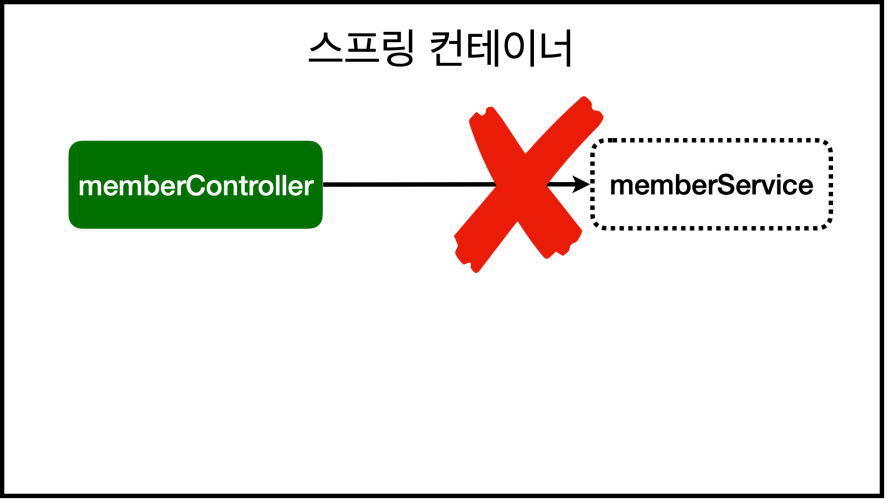
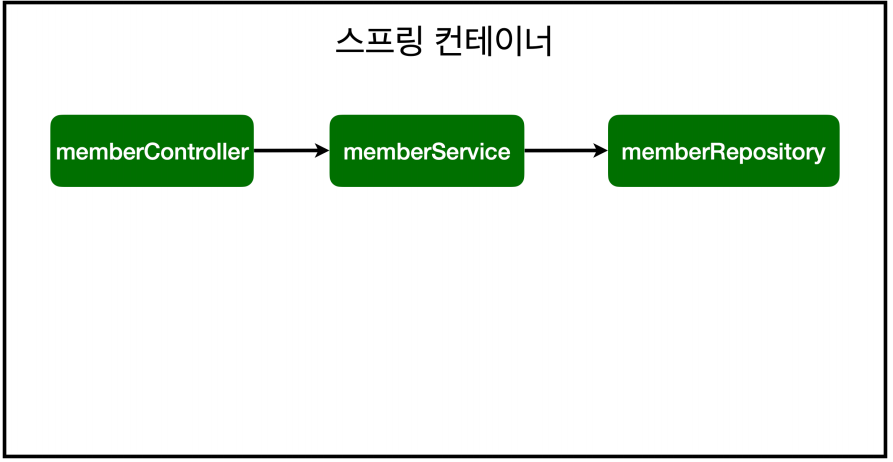

# 스프링 빈과 의존관계
> 본 게시물은 김영한님의 [스프링 입문 - 코드로 배우는 스프링 부트, 웹 MVC, DB 접근 기술](https://www.inflearn.com/course/%EC%8A%A4%ED%94%84%EB%A7%81-%EC%9E%85%EB%AC%B8-%EC%8A%A4%ED%94%84%EB%A7%81%EB%B6%80%ED%8A%B8/dashboard) 강의를 듣고 정리한 내용입니다.  
게시물에 포함된 코드와 이미지 등의 모든 저작권은 인프런과 김영한 강사님께 있습니다.

**Object**
1. [컴포넌트 스캔과 자동 의존관계 설정](#컴포넌트-스캔과-자동-의존관계-설정)
2. [자바 코드로 직접 스프링 빈 등록하기](#자바-코드로-직접-스프링-빈-등록하기)

## 컴포넌트 스캔과 자동 의존관계 설정
- 멤버 컨트롤러는 멤버 서비스를 통해서 회원가입 및 데이터 조회를 할 수 있어야 한다.
  - **멤버 컨트롤러가 멤버 서비스를 의존한다(의존관계)**

**회원 컨트롤러에 의존관계 추가**
```java
// controller/MemberController
@Controller // 스프링 컨테이너가 관리
public class MemberController {

    private final MemberService memberService;

    @Autowired // 스프링 컨테이너에 있는 멤버 서비스를 연결
    public MemberController(MemberService memberService) {
        this.memberService = memberService;
    }
}
```
- 생성자에 **`@Autowired`**가 있으면 스프링이 연관된 객체를 스프링 컨테이너에서 찾아서 넣어준다.
  - **DI(Dependency Injection, 의존성 주입)**: 객체 의존관계를 외부에서 넣어주는 것이다.
  - 생성자가 하나만 있으면 스프링 빈으로 등록되기 때문에 @Autowired를 생략 가능하다.
- 전 강의(예제 테스트)에서는 개발자가 직접 주입하였고, 여기서는 `@Autowired`에 의해 스프링이 주입한다.

**memberSevice가 스프링 빈으로 등록되어 있지 않음**
   
> `helloController`는 스프링이 제공하는 컨트롤러여서 스프링 빈이 자동 등록되어 있다.

**스프링 빈 등록 방법 2가지**
1. 컴포넌트 스캔과 자동 의존관계 설정
2. 자바 코드로 직접 스프링 빈 등록하기

### 컴포넌트 스캔 원리
- **`@Component`** 애노테이션이 있으면 스프링 빈이 자동 등록된다.
  - **`@Controller`**
  - **`@Service`**
  - **`@Repository`**

**회원 서비스 스프링 빈 등록**
```java
@Service // 스프링 컨테이너에 등록
public class MemberService {

    private final MemberRepository memberRepository;

    @Autowired
    public MemberService(MemberRepository memberRepository) {
        this.memberRepository = memberRepository;
    }
}
```

**회원 리포지토리 스프링 빈 등록**
```java
@Repository
public class MemoryMemberRepository implements MemberRepository {}
```

**스프링 빈 등록 이미지**

- `memberService`와 `memberRepository`가 스프링 컨테이너에 스프링 빈으로 등록된다.
> 스프링 컨테이너에 스프링 빈을 등록할 때, 기본적으로 **싱글톤**으로 등록한다. (유일하게 하나만 등록해서 공유) -> **같은 스프링 빈이면 모두 같은 인스턴스**

## 자바 코드로 직접 스프링 빈 등록하기
이게 더 중요하대
```java
@Configuration
public class SpringConfig {

    @Bean
    public MemberService memberService() {
        return new MemberService(memberRepository());
    }

    @Bean
    public MemberRepository memberRepository() {
        return new MemoryMemberRepository();
    }
}
```
- 실무에서는 주로 정형화된 컨트롤러, 서비스, 리포지토리 같은 코드는 컴포넌트 스캔을 사용한다.
  - 정형화 되지 않거나, 상황에 따라 구현 클래스를 변경해야 하면 설정을 통해 **스프링 빈으로 등록**한다.
- `@Autowired`를 통한 DI는 `helloController` , `memberService` 등과 같이 스프링이 관리하는 객체에서만 동작한다.
  - 스프링 빈으로 등록하지 않고 내가 직접 생성한 객체에서는 동작 X

---
## 참고 문서
[Spring Container와 Annotation에 대한 이야기](https://velog.io/@langoustine/Spring-03)