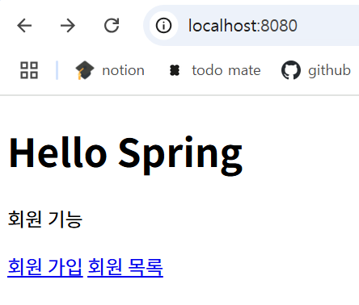
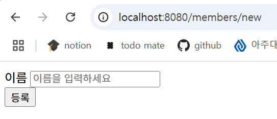
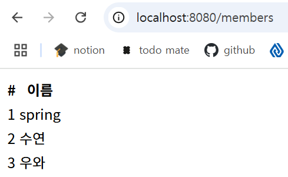

# 회원 관리 예제 - 웹 MVC 개발
> 본 게시물은 김영한님의 [스프링 입문 - 코드로 배우는 스프링 부트, 웹 MVC, DB 접근 기술](https://www.inflearn.com/course/%EC%8A%A4%ED%94%84%EB%A7%81-%EC%9E%85%EB%AC%B8-%EC%8A%A4%ED%94%84%EB%A7%81%EB%B6%80%ED%8A%B8/dashboard) 강의를 듣고 정리한 내용입니다.  
게시물에 포함된 코드와 이미지 등의 모든 저작권은 인프런과 김영한 강사님께 있습니다.

**Object**
1. [회원 웹 기능 - 홈 화면 추가](#회원-웹-기능---홈-화면-추가)
2. [회원 웹 기능 - 등록](#회원-웹-기능---등록)
3. [회원 웹 기능 - 조회](#회원-웹-기능---조회)

## 회원 웹 기능 - 홈 화면 추가
**홈 컨트롤러 추가**
```java
@Controller
public class HomeController {

    @GetMapping("/")
    public String home() {
        return "home"; // templates/home.html 호출
    }
}
```

**회원 관리용 홈**
```html
// templates/home.html
<!DOCTYPE HTML>
<html xmlns:th="http://www.thymeleaf.org">
<body>

<div class="container">
    <div>
        <h1>Hello Spring</h1>
        <p>회원 기능</p>
        <p>
            <a href="/members/new">회원 가입</a>
            <a href="/members">회원 목록</a>
        </p> </div>
</div> <!-- /container -->

</body>
</html>
```

   
- `회원 가입` 누르면 `localhost:8080/members/new`로 이동
- `회원 목록` 누르면 `localhost:8080/members`로 이동
- **컨트롤러가 정적 파일보다 우선순위 높음**

## 회원 웹 기능 - 등록
### 회원 등록 폼 개발

**회원 등록 폼 컨트롤러**
```java
@Controller
public class MemberController {

    @GetMapping("/members/new")
    public String createForm() {
        return "members/createMemberForm";
    }
}

```

**회원 등록 폼 HTML**
```html
<!-- resources/templates/members/createMemberForm -->
<!DOCTYPE HTML>
<html xmlns:th="http://www.thymeleaf.org">
<body>

<div class="container">

    <form action="/members/new" method="post"> <div class="form-group">
        <label for="name">이름</label>
        <input type="text" id="name" name="name" placeholder="이름을 입력하세요">
    </div>
        <button type="submit">등록</button>
    </form>

</div> <!-- /container -->

</body>
</html>
```



### 회원 등록 컨트롤러
**웹 등록 화면에서 데이터를 전달 받을 폼 객체**
```java
public class MemberForm {
    private String name;

    public String getName() {
        return name;
    }

    public void setName(String name) {
        this.name = name;
    }
}
```

**회원 컨트롤러에서 회원을 실제 등록하는 기능**
```java
@Controller
public class MemberController {

    @PostMapping("/members/new")
    public String create(MemberForm form) {
        Member member = new Member();
        member.setName(form.getName());

        memberService.join(member);

        return "redirect:/"; // 홈 화면으로 돌아가기
    }
}
```
- **`@GetMapping`**
  - URL 창에 치는 거
  - 주로 **조회**할 때 사용
- **`@PostMapping`**
  - 데이터를 폼 같은 데 넣어서 **전달**(등록)할 때 사용

## 회원 웹 기능 - 조회
**회원 컨트롤러에서 조회 가능**
```java
@Controller
public class MemberController {

    @GetMapping("/members")
    public String list(Model model) {
        List<Member> members = memberService.findMembers();
        model.addAttribute("members", members);
        return "members/memberList";
    }
}
```

**회원 리스트 HTML**
```html
<!-- templates/members/memberList.html -->
<!DOCTYPE HTML>
<html xmlns:th="http://www.thymeleaf.org">
<body>

<div class="container">
    <div>
        <table>
            <thead>
            <tr>
                <th>#</th>
                <th>이름</th>
            </tr>
            </thead>
            <tbody>
            <tr th:each="member : ${members}">
                <td th:text="${member.id}"></td>
                <td th:text="${member.name}"></td>
            </tr>
            </tbody>
        </table>
    </div>

</div> <!-- /container -->

</body>
</html>
```



- 메모리 안에 있기 때문에 껐다 켜면 데이터 삭제됨 -> 파일이나 데이터베이스에 저장해야함
