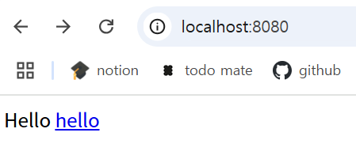

# 프로젝트 환경설정

**Object**
1. [프로젝트 생성](#프로젝트-생성)
2. [라이브러리 살펴보기](#라이브러리-살펴보기)
3. [View 환경설정](#view-환경설정)
4. [빌드하고 실행하기](#빌드하고-실행하기)

## 프로젝트 생성
스프링 부트 스타터 사이트에서 스프링 프로젝트 생성   
https://start.spring.io

- **src**
  - main: 실제 package와 source 파일
  - test: 테스트 코드와 관련된 source 파일
  - 요즘은 위와 같이 main과 test 폴더를 나누는 것이 표준화 되어있음
  - build.gradle: 버전 설정 및 라이브러리 가져오기
    - repositories: 라이브러리 다운 경로
    - dependencies: 템플릿 엔진

## 라이브러리 살펴보기
- gradle, maven 같은 build tool은 의존 관계를 다 관리해줌
  - 의존 관계가 있는 라이브러리를 함께 다운로드 함

- spring-boot-starter-web
  - spring-boot-starter-tomcat
    - 웹 서버 (임베디드 내장)
  - spring-webmvc
- spring-boot-starter-thymeleaf
  - 타임리프 템플릿 엔진(View)
- spring-boot-starter
  - autoconfigure, dependencies, logging, core ...
  - logging
    - 현업에서는 System.out.println() 대신 log를 사용해 출력해야 함
    - log로 남겨야 심각한 에러만 따로 모으거나 log 파일을 관리할 수 있음
    - slf4j, logback -> 요즘은 logback 많이 씀
- spring-boot-starter-test
  - 대부분 junit 사용 (테스트 프레임워크)
  - mockito
  - assertj
    - 테스트 코드를 좀 더 편리하게 작성하도록 도와줌
  - spring-test
    - spring과 통합하여 테스트 도와줌

## View 환경설정
### Welcome Page 만들기
도메인만 누르고 들어왔을 때 첫 화면

resources/static/index.html에 생성하면 됨
```html
<!DOCTYPE HTML>
<html>
<head>
 <title>Hello</title>
 <meta http-equiv="Content-Type" content="text/html; charset=UTF-8" />
</head>
<body>
Hello
<a href="/hello">hello</a></body>
</html>
```




## 빌드하고 실행하기

